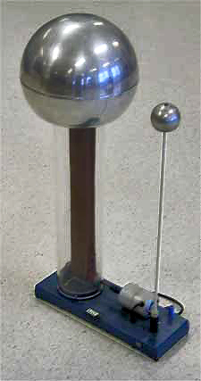
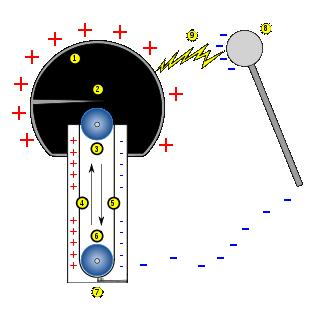

### Theory

The American physicist, Dr. Robert Jemison Van de Graaff invented the Van de Graaff generator in 1931. The device has the ability to produce extremely high voltages - as high as 20 million volts. Van de Graaff invented the generator to supply the high energy needed for early particle accelerators. These accelerators are known as atom smashers because they accelerates the sub atomic particles to very high speeds and then “smash” them in to the target atoms. The resulting collision creates other sub atomic particles and high energy radiations such as X-rays. The ability to create these high energy collisions is the foundation of particle and nuclear physics.

 

  

### Working of the generator is based on two principles:

1. Discharging action of sharp points, ie., electric discharge takes place in air or gases readily, at pointed conductors.
2. If the charged conductor is brought in to internal contact with a hollow conductor, all of its charge transfers to the surface of the hollow conductor no matter how high the potential of the latter may be.

### Theory behind construction:
If we have a large conducting spherical shell of radius ‘R’ on which we place a charge Q, it spreads itself uniformly all over the sphere. The field outside the sphere is just that of a point charge Q at the centre, while the field inside the sphere vanishes. So the potential outside is that of point charge and inside it is constant.

The potential inside the conducting sphere = 
$$\frac{1}{4\pi\varepsilon_{0}}\frac{Q}{R}$$

Now suppose that we introduce a small sphere of radius ‘r’, carrying a charge q, into the large one and place it at the centre. The potential due to this new charge has following values

Potential due to small sphere of radius r carrying charge

$$q=\frac{1}{4\pi\varepsilon_{0}}\frac{q}{r}$$

Potential at the surface of large shellof radius R
$$R=\frac{1}{4\pi\varepsilon_{0}}\frac{q}{R}$$

Taking both charges q and Q in to account we have for the total potential V and the potential difference given by,

$$V(R)=\frac{1}{4\pi\varepsilon_{0}}\left( \frac{Q}{R}+\frac{q}{R} \right)$$

$$V(r)=\frac{1}{4\pi\varepsilon_{0}}\left( \frac{Q}{R}+\frac{q}{r} \right)$$

$$V(r)-V(R)=\frac{1}{4\pi\varepsilon_{0}}\left( \frac{1}{r}-\frac{1}{R} \right)$$

Now assume that q is positive. We see that, independent of the amount of charge Q that may have accumulated on the larger sphere, it is always at a higher potential: the difference V(r) - V(R) is positive. The potential due to Q is constant upto radius R and so cancels out in the difference.

This means that if we connect the smaller and larger sphere by a wire, the charge q on the former will immediately flow on to the matter, even though the charge Q may be quite large. The natural tendency is for positive charge to move higher to lower potential. Thus, provided we are somehow able to introduce the small charged sphere into the larger one, we can in this way pile up larger and larger amount of charge on the latter. The potential of the outer sphere would also keep rising, at least until it reaches the breakdown field of air.

### Construction

 

  

It consists of a large metal sphere mounted on high insulating supports. An endless belt b, made of insulating material such as rubber, passes over the vertical pulleys P1 and P2. The pulley P2 is at the centre of the metal sphere and the pulley P1 is vertically below P2. The belt is run by an electric motor M. B1and B2 are two metal brushes called collecting combs.

The positive terminal of a high tension source (HT) is connected to the comb B1. Due to the process called action of points, charges are accumulated at the pointed ends of the comb, the field increases and ionizes the air near them. The positive charges in air are repelled and get deposited on the belt due to corona discharge. The charges are carried by the belt upwards as it moves. When the positively charged portion of the belt comes in front of the brush B2, by the same process of action of points and corona discharge occurs and the metal sphere acquires positive charges. The positive charges are uniformly distributed over the surface of the sphere. Due to the action of points by the negative charges carried by the gas in front of the comb B2, the positive charge of the belt is neutralized. The uncharged portion of the belt returns down collects the positive charge from B1 which in turn is collected by B2. The charge transfer process is repeated. As more and more positive charges are imparted to the sphere, its positive potential goes on rising until a surface maximum is reached. If the potential goes beyond this, insulation property of air breaks down and the sphere gets discharged. The breakdown of air takes place in an enclosed steel chamber filled with nitrogen at high pressure.

